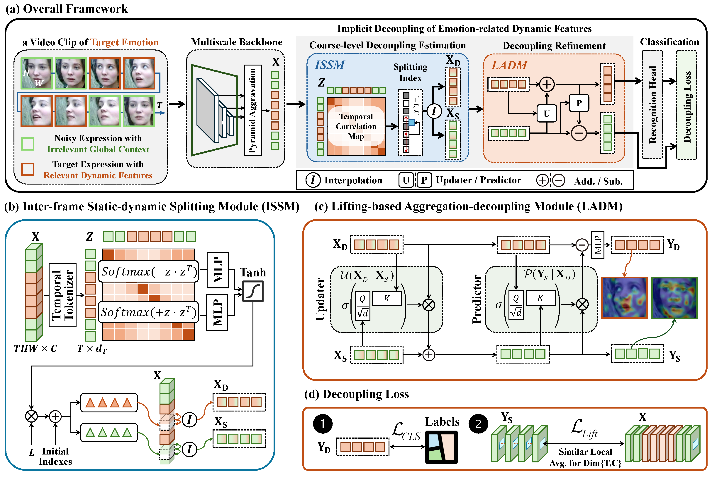

# IFDD

> Lifting Scheme-Based Implicit Disentanglement of Emotion-Related Facial Dynamics in the Wild

This repository contains the <strong>implementation codes</strong> and <strong>configurations</strong> of IFDD, along with the <strong>technical appendix</strong> that involves additional comparisons, discussions, and further ablation studies complementary to our paper. 

 Formal code is coming soon. Currently, codes in this repository is not the final version. They still contain some remnants of other researches by our Lab, and may lack some related functions. Please note that, these remnants do not affect our implementation since they are disabled by EXP_IFDD_XXX.py config files in exps/ folder. We are in the process to remove them and simplifying repository.

The contents are as follows:

- [TODO](#todo)
- [Introduction](#introduction) (Done)
- [1. Environment Settings](#1-environment-settings) (Coming soon)
- [2. Data Preparation](#2-data-preparation) (Coming soon)
- [3. Evaluation](#3-evaluation) (Coming soon)
- [4. Training ](#4-training)(Coming soon)
- [Acknowledgement](#acknowledgement) (Coming soon)
- [Citation ](#citation)(Coming soon)

## TODO

- [ ] Simplified code implementation.
- [ ] A concise, minimalist guidance of environment configuration.
- [ ] Detailed guidelines for the installation, data preparation, train, test, and config settings.
- [ ] A technical appendix complementary to our paper.

## Introduction

In-the-wild Dynamic facial expression recognition (DFER) encounters a significant challenge in recognizing emotion-related expressions, which are often temporally and spatially diluted by emotion-irrelevant expressions and global context respectively. 

Given the aforementioned concerns, we propose Implicit Facial Dynamics Disentanglement framework (<strong>IFDD</strong>) to disentangle emotion-related dynamic features from global context in an implicit manner. Through expanding the framework of lifting scheme, IFDD proposes Inter-frame Static-dynamic Splitting Module (<strong>ISSM</strong>) and Lifting-based Aggregation-Decoupling Module (<strong>LADM</strong>) for two-stage disentanglement.

Specifically, ISSM explores inter-frame correlation to generate content-aware splitting indexes on-the-fly. We preliminarily utilize these indexes to split frame features into two groups, one with greater global similarity, and the other with more unique dynamic features. Subsequently, LADM first aggregates these two groups of features to obtain fine-grained global context features by an updater, and then disentangles emotion-related facial dynamic features from the global context by a predictor.

For more details, please refer to [our paper]().

<h2 align="center">Overview framework of IFDD</h2>

IFDD consists of four parts:

1. multiscale backbone followed by pyramid aggregation.
2. Inter-frame Static-dynamic Splitting Module (ISSM).
3. Lifting-based Aggregation-Decoupling Module (LADM).
4. recognition head with decoupling loss.

Based on the spatiotemporal features extracted by backbone, ISSM and LADM modules are proposed to further decouple emotion-related dynamic features from emotion-irrelevant global context.

